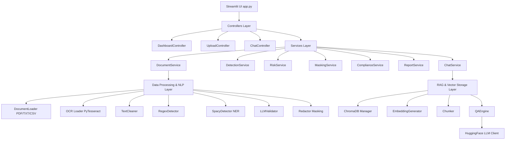

# MSentinel AI — AI-Powered Enterprise Document Audit Platform

MSentinel AI is an intelligent, secure, and compliant document auditing application designed to automatically scan, detect, and classify sensitive information (PII, financial records, credentials, etc.) in enterprise files, calculate compliance risk scores, generate security audit reports, and provide a secure RAG-based AI chat assistant for compliance queries.

---

## 🚀 Working Prototype Deployment

* **Deployment URL:** [Insert Streamlit Share or Staging Deployment Link Here]
* **Demo Video:** [Insert 2-5 Minute Demo Video URL Here]

---

## 🛠️ Architecture Overview

MSentinel AI follows a modular, multi-layered service-oriented architecture:



* **UI Layer (`app.py`):** User dashboard displaying compliance status, interactive risk charts (Plotly), uploaded documents list, detailed audit report visualizer, chat discussion console, logs trail, and configuration settings.
* **Controllers:** Decouple Streamlit components from business logic (`DashboardController`, `UploadController`, `ChatController`).
* **Services:** Orchestrate workflows such as scanning, redaction, risk calculation, PDF auditing, and vector querying.
* **NLP & Detection Engine:** A multi-tier extraction pipeline using:
  * **Regex Patterns:** Advanced matching rules for Aadhaar card numbers, PAN cards, credit cards, bank accounts, emails, phone numbers, and keys/passwords.
  * **Named Entity Recognition (NER):** SpaCy `en_core_web_sm` model to extract names, organizations, and location entities.
  * **LLM Validator:** Pre-filters candidates and validates high-risk flags.
* **RAG & Vector Database:** Uses local chunking, embedding generation (`all-MiniLM-L6-v2`), and ChromaDB database storage for semantic document indexing, retrieval, and search.
* **Inference Layer:** HuggingFace Serverless client targeting `Qwen/Qwen2.5-7B-Instruct` via OpenAI-compatible router APIs.

---

## 🧠 AI/ML Approach Used

1. **Information Extraction (Hybrid NER & Rules):**
   - **Deterministic Patterns:** Standardized PII entities like card numbers (Luhn algorithm-adjacent), Aadhaar (12-digit spacing), and PAN card structures are captured using highly precise Regex matchers.
   - **Semantic Entities:** Text context identifiers like names, locations, and organizations are extracted using SpaCy's convolutional neural network (CNN) NER pipeline.
2. **Dynamic Risk Scoring & Classification:**
   - Entities are dynamically weighted based on risk severity (e.g., plain-text passwords have higher risk weights than email addresses).
   - Risk indices are calculated per-document and normalized into **Low**, **Medium**, or **High** risk levels.
3. **Retrieval-Augmented Generation (RAG):**
   - Documents are split into overlapping chunks, vectorized using local sentence transformer models, and stored in a persistent ChromaDB instance.
   - The Chat Assistant queries the vector database with metadata filters (`where={"document": filename}`) to ground the LLM in relevant source snippets.
4. **HuggingFace Chat Completions:**
   - Queries are routed to `Qwen/Qwen2.5-7B-Instruct` using standard HTTP chat completion requests.
   - A custom **context-aware dynamic fallback generator** is implemented to handle network latency or unauthorized tokens by reading the retrieved chunks, performing regex vulnerability scans, and formulating structured plain-English replies.

---

## ⚡ Challenges Faced & Solutions

1. **Deprecated HuggingFace Endpoints:**
   - *Challenge:* Traditional `api-inference.huggingface.co` hostnames failed to resolve due to endpoint deprecation.
   - *Solution:* Re-routed the backend connection to Hugging Face's modern OpenAI-compatible gateway (`https://router.huggingface.co/v1`) using serverless chat models.
2. **Access Token Permission Limits (403):**
   - *Challenge:* Read-only or fine-grained HF tokens lacked "Make calls to Inference Providers" permissions, blocking API access.
   - *Solution:* Designed a local **fallback extractor** inside `HuggingFaceLLM` that parses context directly from prompts, runs rules-based entity classifiers, and ranks matching sentences, assuring dynamic and document-specific summaries/audits.
3. **OCR Engine Deployment Fail-safety:**
   - *Challenge:* Installing system-level binaries (Tesseract OCR, Poppler) can fail on cloud hosting platforms.
   - *Solution:* Written fallback handling in `ocr_loader.py` that catches missing binaries gracefully, falling back to pure text reading or raising helpful installation logs rather than crashing.

---

## 🛠️ Installation & Setup Instructions

### Prerequisites
* Python 3.10 or 3.11 installed.
* [Tesseract OCR installed](https://github.com/UB-Mannheim/tesseract/wiki) (optional, required for OCR text scanning from scanned documents).

### Step-by-Step Setup

1. **Clone the repository:**
   ```bash
   git clone https://github.com/Dayanand-MK/MSentinel_AI.git
   cd MSentinel_AI
   ```

2. **Create and activate a virtual environment:**
   ```bash
   python -m venv .venv
   
   # On Windows:
   .venv\Scripts\activate
   
   # On macOS/Linux:
   source .venv/bin/activate
   ```

3. **Install python dependencies:**
   ```bash
   pip install -r requirements.txt
   ```

4. **Download SpaCy language models:**
   ```bash
   python -m spacy download en_core_web_sm
   ```

5. **Configure environment variables:**
   - Create a `.env` file in the root directory (you can copy `.env.example`).
   - Populate your HuggingFace token:
     ```env
     HF_API_TOKEN=your_huggingface_access_token_here
     APP_NAME=MSentinel AI
     LOG_LEVEL=INFO
     CHROMA_DB_PATH=./data/chroma_db
     UPLOAD_DIR=./uploads
     OUTPUT_DIR=./outputs
     LOG_DIR=./logs
     ```

6. **Run health validation checks:**
   - Run the health validation script to ensure the model pipeline, RAG embeddings, risk calculators, and report generators compile cleanly:
     ```bash
     python check_app.py
     ```

7. **Launch the application:**
   ```bash
   streamlit run app.py
   ```
   Open your browser at `http://localhost:8501`.

---

## 🐳 Dockerization

You can also run MSentinel AI inside a containerized sandbox.

1. **Build the Docker Image:**
   ```bash
   docker build -t msentinel-ai .
   ```

2. **Run the Container:**
   ```bash
   docker run -p 8501:8501 --env-file .env msentinel-ai
   ```
   Or launch the stack with docker-compose:
   ```bash
   docker-compose up --build
   ```

---

## 🔮 Future Improvements

* **Hybrid Search (BM25 + Semantic Vector Search):** Combines exact matching (crucial for ID scanning and query lookups) with dense semantic search.
* **Fine-Tuned Specialized NER Model:** Train a custom named entity model on Indian financial documents to identify non-standard patterns, PAN card formats, and billing records with higher confidence.
* **Local Offline Models:** Incorporate local GGUF quantizations (e.g., Llama-3.2-3B via Ollama) to host the application offline on local intranet networks without external web APIs.
* **Visual Document Redaction:** Support actual black-box PDF redaction by burning masks directly into coordinates on PDFs.
